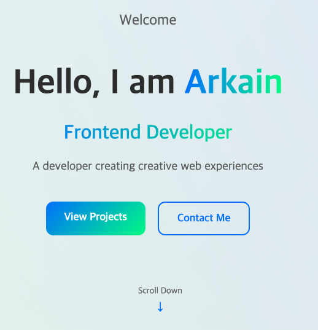
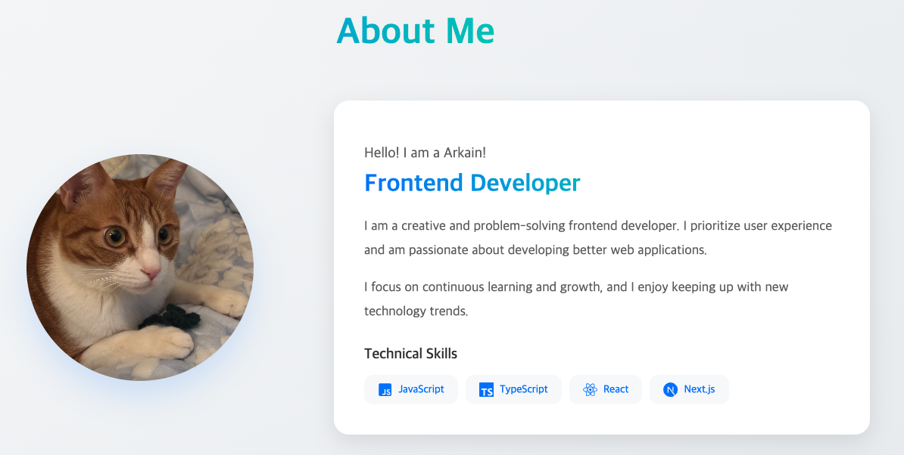
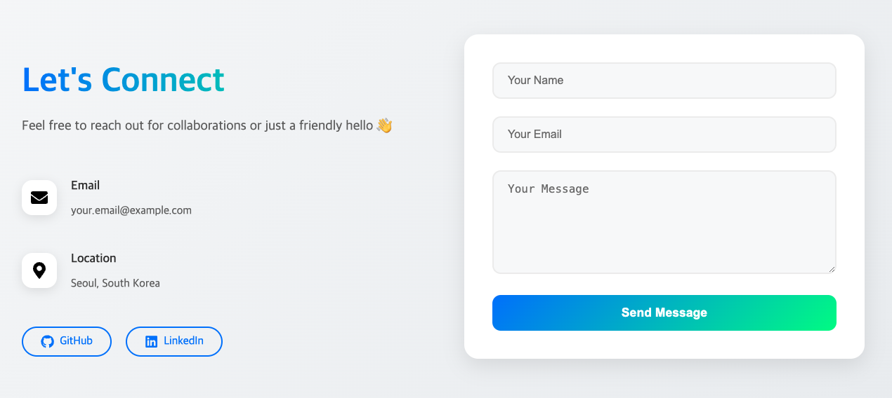

```
┌─────────────────────────────────────────────────────────┐
                 _              _               _
                | |            (_)             (_)
   __ _   _ __  | | __   __ _   _   _ __        _    ___
  / _` | | '__| | |/ /  / _` | | | | '_ \      | |  / _ \
 | (_| | | |    |   <  | (_| | | | | | | |  _  | | | (_) |
  \__,_| |_|    |_|\_\  \__,_| |_| |_| |_| (_) |_|  \___/


└─────────────────────────────────────────────────────────┘
```

# Portfolio Template Project

- This template is designed for custom portfolio using `NextJS`, `Spring Boot`.

## Features

- Create a personalized portfolio website using Arkain's AI.
- Customizable templates for showcasing your projects.
- Integration with various APIs for dynamic content.
- Easy deployment and hosting options.
- Responsive design for mobile and desktop views.
- SEO-friendly structure to improve visibility.
- Built-in analytics to track visitor interactions.
- Secure authentication and user management.
- Regular updates and community support.
- Detailed documentation and tutorials.

## Folder Structure

client

```
front
├── node_modules
├── next.config.ts
├── package-lock.json
├── package.json
├── tsconfig.json
├── public
│   └── images
└── src
    ├── app
    │   ├── about
    │   ├── contact
    │   ├── home
    │   └── projects
    ├── components
    │   ├── charts
    │   └── common
    │       ├── ChartNavigation
    │       ├── Footer
    │       ├── Header
    │       └── Navigation
    ├── data
    ├── lib
    ├── pages
    │   └── api
    ├── styles
    └── types
```

server

```
back
├── build.gradle
├── gradlew
├── settings.gradle
├── gradle
│   └── wrapper
└── src
    └── main
          └── java
                └── arkain
                    └── dev
                        └── portfolio
                            └── server
                                ├── auth
                                │   ├── app
                                │   │   └── dto
                                │   ├── domain
                                │   ├── repo
                                │   └── ui
                                ├── common
                                │   ├── dto
                                │   ├── exception
                                │   ├── filter
                                │   └── web
                                │       └── ui
                                ├── config
                                │   ├── security
                                │   │   ├── domain
                                │   │   ├── jwt
                                │   │   └── provider
                                │   ├── socket
                                │   └── web
                                │       └── resolver
                                ├── contact
                                │   ├── app
                                │   │   └── dto
                                │   ├── repo
                                │   │   └── entity
                                │   └── ui
                                └── visitor
                                    ├── app
                                    │   ├── dto
                                    │   └── util
                                    ├── repo
                                    │   └── jpa
                                    │       └── entity
                                    └── ui
```

## Getting Started

### Prerequisites

front

- **Next.js 15.2.1**
- **React 19.0.0**
- **React DOM 19.0.0**
- **Emotion 11.14.0**
- **Axios 1.8.2**
- **Framer Motion 12.4.10**
- **React Icons 5.5.0**
- **React Intersection Observer 9.16.0**
- **React Scroll 1.9.3**
- **Recharts 2.15.1**

back

- **Java 21**
- **Spring Boot 3.4.3**
- **Spring Web Socket**
- **MySQL 8**

### Installation & Setup

**Check URL and Port**

- Click Running URL and Port in the top left menu bar.
- When you run the project, the server will be available at port 8080.

<br>

**Home Page**



- Name, Role, and Introduction
  - Add your name and professional role.
  - Write a brief introduction about yourself.
- Personalized Bio
  - Share your background, skills, and interests.
  - Highlight your expertise and key achievements.
- Home: Your Portfolio’s Gateway
  - This is the main entry point of your portfolio.
  - Make a strong first impression with a well-crafted introduction.
  - Showcase your personality, skills, and professional journey effectively.

**About Page**



- Your Personal Profile
  - Upload your photo for a personalized touch.
  - Write a detailed introduction about yourself.
- Technical Skills
  - List your core skills and expertise.
  - Highlight programming languages, frameworks, and tools you use.
- Additional Information
  - Include links to your blog, portfolio, or GitHub.
  - Add any relevant projects, certifications, or experiences.
- Make It Your Own!
  - Customize this section to reflect your personality and career journey.
  - Share insights about your professional growth and aspirations.

**Project Page**


- Showcase Your Work
  - Share the projects you have worked on.
  - Highlight your key contributions and achievements.
- GitHub Repository
  - Provide a link to your project's GitHub repository.
  - Allow others to explore your code and contributions.
- Live Demo
  - Include a link to a live demo of your project.
  - Let visitors experience your work in action.
- Project Details
  - Briefly describe the purpose and features of your project.
  - Mention the technologies and tools used.
- Make an Impact!
  - Show off your creativity and problem-solving skills.
  - Engage your audience with a well-documented and visually appealing presentation.

**Contact Page**



- Stay Connected
  - Allow visitors to reach out after viewing your portfolio.
  - Provide an easy way for potential collaborators or employers to contact you.
- Leave a Message
  - Visitors can submit their contact details and messages.
  - Encourage meaningful connections and networking opportunities.
- Check Your Messages
  - Log in to view and manage received contacts.
  - Stay updated on new inquiries and potential opportunities.
- Make It Easy to Connect
  - Optionally include your email, LinkedIn, or other contact methods.
  - Ensure a professional and approachable communication experience.

**Setting Login Credentials Using Environment Variables**

- You can set the login ID and password using environment variables.
- Use the `sh/update_user.sh` script to easily change the user ID and password.
- The login process uses JWT tokens for secure access to your personal website.
- **Warning:** Be careful not to expose these credentials.

```bash
cd /workspace/portfolio/portfolio
./sh/update_user.sh
# input your own user name & password to the prompt
source ~/.bashrc
```

You must use source ~/.bashrc to apply the password changes. After changing the environment variables, please restart the server.

<br>

**Visitor Statistics Management**

- Track the number of visitors to your portfolio on an hourly, weekly, and monthly basis.
- Get notified immediately when someone visits your site.
- Use detailed analytics to understand visitor patterns and improve your portfolio.
- Real-time updates ensure you always have the latest data on your visitors.
- Easily accessible through the integrated dashboard.
- Get insights into peak visiting hours and popular content.
- Set up notifications for significant visitor milestones.
- Leverage this data to enhance user engagement and portfolio performance.

**Customization**

- Customize Your Portfolio with Arkain
  - Personalize your portfolio site to reflect your unique style.
  - Modify layouts, colors, and components to match your branding.
- Enhance Your Project Showcase
  - Add new projects and highlight key features.
  - Provide in-depth descriptions, GitHub links, and live demos.
- Expand Your Detail Page
  - Include additional information such as work experience, skills, or achievements.
  - Share links to your blog, LinkedIn, or other professional platforms.
- Edit Your Pages Easily
  - Modify content directly in `/workspace/portfolio/portfolio/front`.
  - Adjust layouts, add new sections, or refine text effortlessly.
- Add Custom Statistics
  - Track project-specific visitor counts.
  - Display the number of active viewers in real time.
  - Implement analytics to gain insights into user engagement.
  - Add custom API into `/workspace/portfolio/portfolio/back`.
- Make It Truly Yours!
  - Experiment with new features and improvements.
  - Create a dynamic and interactive portfolio experience.

### Contributing

We welcome contributions to enhance this boilerplate! Feel free to submit a pull request or open an issue for suggestions or bug fixes.

## 🔧 Tip & Guide

1. **Get URL and Port**

   - You can get the default URL/Port and add URL/Port on the top right.
   - Move your mouse pointer over the [Preview] → [Running URL and Port] button in the menu bar (no click needed).

2. **Command feature**

   - You can simply run your script using the shortcut icons on the top right.
   - Move your mouse pointer over the [Run] → [Add run command] button in the menu bar (no click needed).

3. **SSH Configuration**
   - This feature is only available for membership users.
   - You can SSH to the Arkain container from the outside via the [Menu]->[SSH Configuration] in menu bar.

### 💬 Support & Documentation

Visit [https://arkain.io](https://arkain.io) to support and learn more about using Arkain.
To watch some usage guides, visit [https://docs.arkain.io](https://docs.arkain.io)
